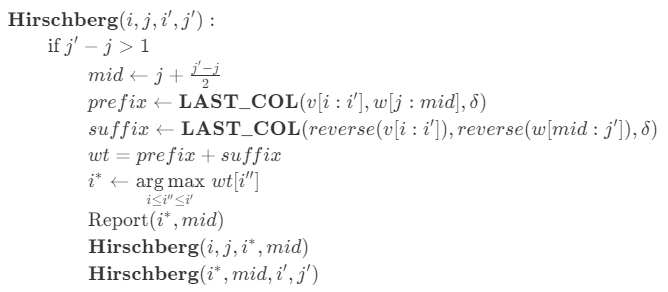

# CS466 Introduction to Bioinformatics Course Project - Analysis and Implementation of Hirschberg Algorithm

## Contents
  - [Abstract](#abstract)
  - [Global Alignment](#global-alignment)
  - [Needleman-Wunsch](#needleman-wunsch)
  - [Hirschberg](#hirschberg)
  - [Analysis](#analysis)
  - [Run](#run)


<a name="abstract"></a>
## Abstract
In this course project for CS466 Introduction to Bioinformatics, we implemented and analyzed the time complexity and space complexity of the linear space global alignment algorithm - Hirschberg algorithm, and made a comparison to the Needleman-Wunsch algorithm. 
<pre xml:lang="latex">\sqrt{2}</pre>
$'\sqrt{2}'$
```math
\sqrt{2}
```
<a name="global"></a>
## Global Alignment
Given two strings  and , where  is the set of characters, a scoring function , find alignment with maximum score.

An alignment  is a  matrix s.t. 
- 
- 
- there is no  where 

<a name="needleman-wunsch"></a>
## Needleman-Wunsch
&space;0&space;\qquad\qquad\quad\&space;deletion&space;\\&space;&space;&space;s[i,j-1]&space;&plus;&space;\delta(-,w_j)&space;&\text{if&space;}&space;j&space;>&space;0&space;\qquad\qquad\quad\&space;insertion&space;\\&space;&space;s[i-1,j-1]&space;&plus;&space;\delta(v_i,w_j)&space;&\text{if&space;}&space;i&space;>&space;0&space;\text{&space;and&space;}&space;j&space;>&space;0&space;\quad&space;match/mismatch\end{cases}" title="s[i,j] = \max\begin{cases} 0 &\text{if } i=0 \text{ and } j=0 \\ s[i-1,j] + \delta(v_i,-) &\text{if } i > 0 \qquad\qquad\quad\ deletion \\ s[i,j-1] + \delta(-,w_j) &\text{if } j > 0 \qquad\qquad\quad\ insertion \\ s[i-1,j-1] + \delta(v_i,w_j) &\text{if } i > 0 \text{ and } j > 0 \quad match/mismatch\end{cases}" />

Needleman-Wunsch algorithm uses dynamic programming approach converting the alignment problem to a bottom-up filling out dp table problem. 

Time Complexity:  

Space Complexity: 

<a name="hirschberg"></a>
## Hirschberg


 is the starting point and  is the ending point. 

 and  are the input sequences.  is the scoring function. 

 is a modified Needleman-Wunsch algorithm that returns the rightmost column of the dynamic programming table. 

Hirschberg algorithm uses the idea of divide and conquer. For each recursion, we fill out the dynamic programming table  to , find the optimal row in the middle column, divide the problem into two subproblems and conquer them recursively.

Time Complexity: 
 

Same order but 2 times slower than the Needleman-Wunsch algorithm

Space:  only store two related columns when calculating the prefix and suffix and only store the prefix column and suffix column when searching for .

<a name="analysis"></a>
## Analysis
The codes for analysis and comparison are in *Analysis_Comparison_Hirschberg.ipynb*. To run the analysis, it is better to run the file in Google colab. Otherwise, you might need to install the memory\_profiler library on your own. We use the *profile* function decorator in *memory\_profiler* library, *\%memit* and *\%mprun* in google colab to trace the memory usage and we use the *\%prun* in google colab to trace the running time. The input sequence are generated randomly by *numpy.random.choice* function and the scoring function $\delta$ we use is defined as follows: 


|                  | Needleman-Wunsch | Hirschberg |
|:----------------:|:----------------:|:----------:|
| Time Complexity  |          |    | 
| Space Complexity |          |      |

<a name="run"></a>
## Run
There are two .py files containing the implementation for corresponding algorithms. To run the file, use the following commands in terminal. You can use optional arguments to align the sequences you want. 

    $ python Needleman-Wunsch.py [--help|-h] [--i float] [--d float] [--s float] [--m float] 
                                    [--seqA str] [--seqB str] [--lenA int] [--lenB int]

    $ python Hirschberg.py [--help|-h] [--i float] [--d float] [--s float] [--m float] 
                                    [--seqA str] [--seqB str] [--lenA int] [--lenB int]

    optional arguments:
    -h, --help   show this help message and exit
    --i I        Insertion score
    --d D        Deletion score
    --s S        Substitution score
    --m M        Match score
    --seqA SEQA  The first input sequence
    --seqB SEQB  The second input sequence
    --lenA LENA  The length of the first input sequence
    --lenB LENB  The length of the second input sequence
